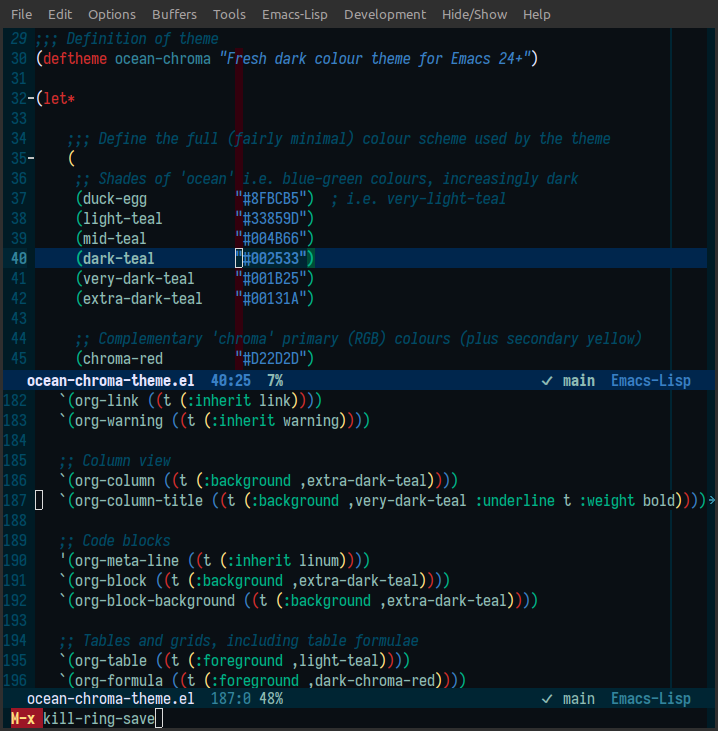
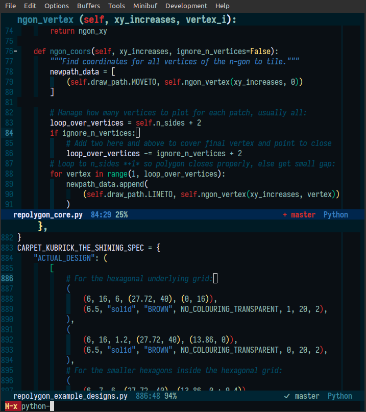
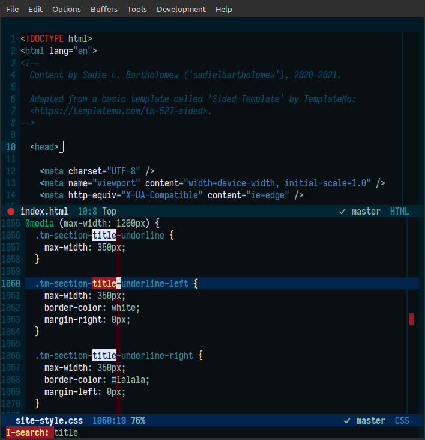
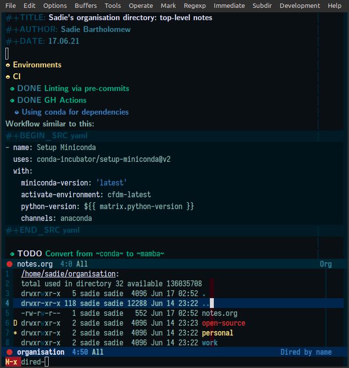

# ocean-chroma-theme

### A fresh dark colour theme for Emacs 24+ based on blue-green and primary colours

`ocean-chroma` is a dark theme that is based upon ocean-like teal colours
('ocean') and bold primary (blue, red, green) and secondary (yellow) 'chroma'
colours, providing a style that is striking, allowing quick comprehension of
syntactic and organisational elements via bold colouring, but also
harmonious (read: not ugly), where guide and background elements are generally
depicted in the more subtle ocean colours.

## Screenshots

Screenshots of an Emacs window with buffers covering a small selection
of languages, modes and active features, where `ocean-chroma` is set as the
theme in all cases:

### Emacs Lisp

### Python

### HTML and CSS (with an active `isearch`)

### `org-mode` and `dired`

### Notes about the screenshots

Note that the screenshots above are taken with my personal
[`.emacs` configuration](https://github.com/sadielbartholomew/sadielbartholomew/blob/master/dotfiles/.emacs),
where, notably:

* the `Iosevka SS02 Medium` font is used for frames and fixed-pitch aspects
  and `CMU Sans Serif` font (in bold) is used for variable-pitch aspects;
* certain third-party packagaes are enabled and minimally configured
  (without changing the style configured by the `ocean-chroma` theme) such as
  `hl-line`, `col-highlight`, `highlight-indentation`, and `awesome-tab`.

## Underlying colour scheme

Only sixteen harmonious colours are used for this theme, namely the
following palette:

## Status

:pushpin: **The `ocean-chroma` theme is functional and ready-for-use, but note
it is still under development so a lot of third-party customisation has not
yet been added or tweaked to best effect.** :pushpin:

Explicitly, this theme as-is includes:

* full customisation covering *all* built-in faces and generic elements
  (e.g. those relating to the fringe, highlighting, incremental search,
  the mode line, tool tips, links, diffs etc.);

* full customisation of *many* built-in modes, though not all of them (other
  than indirect customisation by inheritance of faces that are already
  directly customised), those modes currently being:
  * `org-mode`;
  * `outline-mode`;
  * `compilation-mode`;
  * `diff-mode`;
  * `smerge-mode`;
  * `whitespace-mode`;
  * `dired`;
  * `git` built-in modes (so not including `magit`, etc.);

* full customisation of *some* third-party modules, namely (so far):
  * `col-highlight`;
  * `hl-line`;
  * `diff-hl`;
  * `fill-column-indicator`;
  * `highlight-indentation`;
  * `visible-mark`;
  * `rainbow-delimiters`;
  * `hlinum`.
